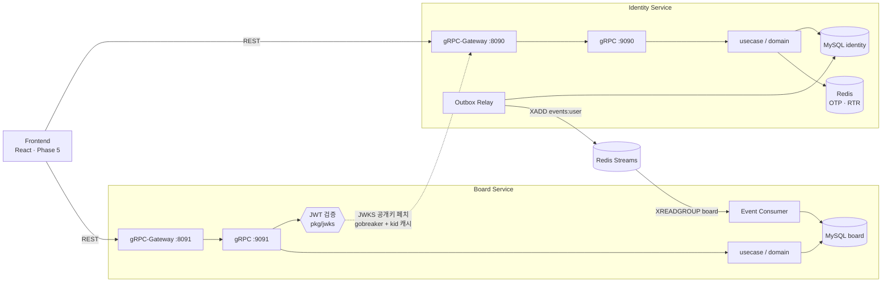
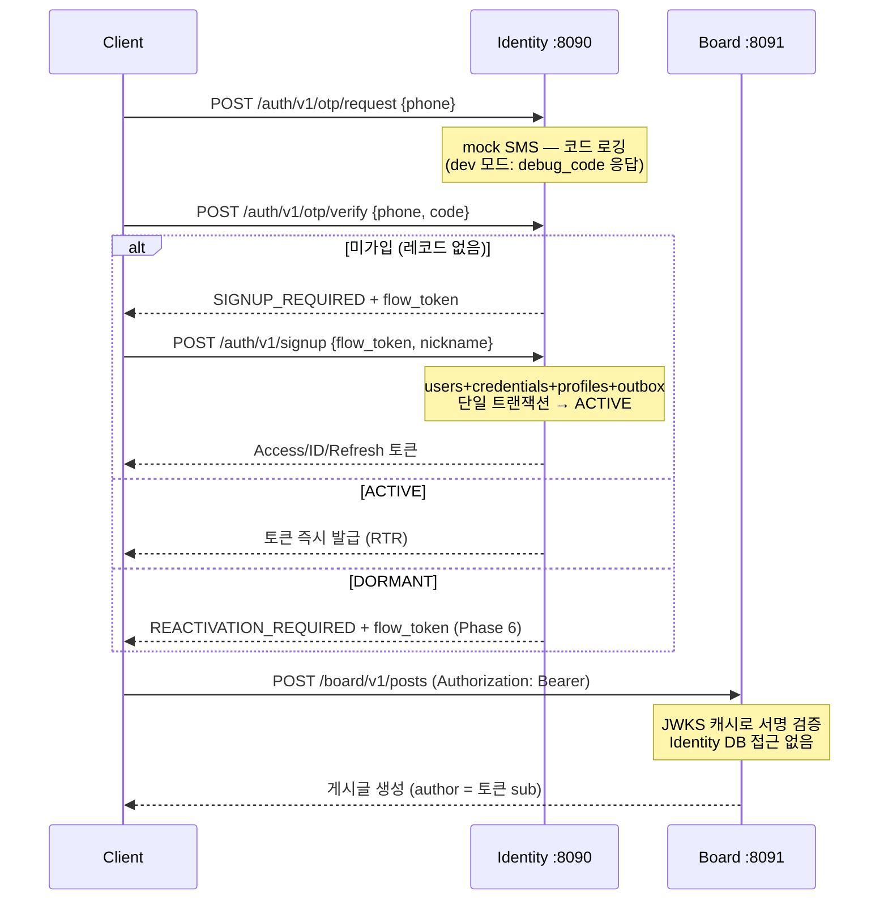

# 🛡️ Global Identity Service Platform (MSA PoC)

대규모 트래픽(목표 21M MAU)을 가정한 **MSA 기반 Identity Provider(IdP)** Proof of Concept입니다.
모놀리식 시스템의 인증/인가 병목을 해소하기 위해 인증 시스템을 독립적인 OIDC 스타일 Provider로 분리하고,
다른 마이크로서비스(Board 리소스 서버)가 IdP 발급 토큰을 **무상태(Stateless)로 검증**하는 E2E 흐름을 구현합니다.

> 상세 스펙은 [`prd.md`](./prd.md), 단계별 진행 기록은 [`plan/`](./plan/) 디렉토리를 참고하세요.

## 핵심 데모 포인트

| # | 주제 | 구현 |
| :--- | :--- | :--- |
| 1 | **무상태 토큰 검증** | Board는 Identity DB에 접근 권한 자체가 없음. JWKS 공개키 캐시만으로 서명 검증 |
| 2 | **Protobuf 주도 개발** | `.proto`가 단일 진실 공급원 — gRPC 코드, REST 프록시(gRPC-Gateway), Swagger 자동 생성 |
| 3 | **Refresh Token Rotation** | 재사용 탐지 시 토큰 패밀리 전체 무효화 (탈취 대응) |
| 4 | **트랜잭셔널 아웃박스** | DB 쓰기와 이벤트 발행의 원자성 보장, at-least-once + 멱등 컨슈머 |
| 5 | **이벤트 기반 읽기 모델** | Board가 `user.created` 이벤트로 닉네임을 로컬 복제 — 조회 시 Identity 호출 없음 |
| 6 | **레이어드 아키텍처** | domain / usecase / repo / delivery 분리, `cmd → app` 컴포지션 루트 |

## 시스템 아키텍처

엔터프라이즈급 목표를 이해하되, 로컬 실행 가능한 경량 대안으로 치환합니다.

| 구성 요소 | 목표 (Enterprise) | PoC 구현 (현재) |
| :--- | :--- | :--- |
| 인프라 / 라우팅 | Kubernetes | **Docker Compose** |
| 서비스 통신 | gRPC / API Gateway | **gRPC + gRPC-Gateway(REST 프록시)** |
| 서킷 브레이커 | Istio (Envoy) | **`sony/gobreaker`** — Board→Identity JWKS 페치에 적용 |
| 이벤트 스트리밍 | Apache Kafka | **Redis Streams** (컨슈머 그룹, at-least-once) |
| 데이터베이스 | MySQL Cluster (DB per service) | **MySQL 단일 컨테이너, `identity`/`board` DB 분리** (cross-DB 조인 금지) |
| 서명 키 관리 | KMS / HSM | 로컬 PEM (named volume, gitignore) |



## 모노레포 구조

```text
identity-service/
├── api/
│   ├── proto/                  # [공유 계약] identity.v1 / board.v1 — 언어 중립 SSoT
│   └── gen/                    # 생성 코드 (gRPC, gateway, swagger) — 커밋됨
├── services/
│   ├── identity/               # 1. Identity Provider (인증, 토큰 발급)
│   │   ├── cmd/                # main: config + logger + app 조립만
│   │   ├── internal/
│   │   │   ├── app/            # 컴포지션 루트 (인프라 연결, graceful shutdown)
│   │   │   ├── domain/         # 순수 도메인 — 계정 상태머신
│   │   │   ├── usecase/        # 인증 오케스트레이션 (상태 라우팅)
│   │   │   ├── repo/mysql/     # 트랜잭셔널 아웃박스 포함 영속성
│   │   │   ├── token/          # RS256 발급, JWKS/디스커버리, 플로우 토큰
│   │   │   ├── rtr/            # Refresh Token Rotation (Redis)
│   │   │   ├── otp/            # OTP 저장소 (Redis, TTL/시도 제한/레이트리밋)
│   │   │   ├── outbox/         # 아웃박스 → Redis Streams 릴레이
│   │   │   └── delivery/       # gRPC 핸들러 + HTTP(gateway·OIDC) 구성
│   │   └── db/migrations/
│   └── board/                  # 2. 리소스 서버 (무상태 검증 데모)
│       ├── internal/           # 동일 레이어링 + consumer/ (이벤트 → 읽기 모델)
│       └── db/migrations/
├── web/                        # 3. React 데모 클라이언트 (Vite + TS, Phase 5)
├── pkg/
│   ├── logger/                 # zerolog 공용 로거 (request-id 전파)
│   └── jwks/                   # 무상태 JWT 검증기 (kid 캐시 + 서킷 브레이커)
├── scripts/                    # 마일스톤 스모크 테스트
├── docker-compose.yml          # mysql · redis · identity · board
└── Makefile
```

## 인증 플로우 (상태 기반 라우팅)

OTP 검증 후 계정 `status`에 따라 동적으로 라우팅됩니다.



계정 상태머신: `PENDING → ACTIVE ⇄ DORMANT`, `ACTIVE/DORMANT → SUSPENDED → ACTIVE`, 모든 상태 → `DELETED`(종단).

## 토큰 & 키 스펙

| 항목 | 값 |
| :--- | :--- |
| 서명 | RS256, JWT 헤더에 `kid` 포함 (JWKS는 현재+이전 키 서빙으로 무중단 회전) |
| Access Token | TTL **15분** — `iss, sub, aud("board"), exp, iat, jti, status` |
| ID Token | OIDC 표준 클레임 + `nickname`, `aud("poc-frontend")` |
| Refresh Token | 불투명 토큰, TTL **14일**, Redis에 토큰 패밀리로 저장 |
| RTR | 갱신마다 회전. **이미 회전된 토큰 재사용 → 패밀리 전체 무효화** → 재로그인 강제 |
| Flow Token | 다단계 플로우 연결용 (10분, purpose 스코프: signup / reactivation / device_verify) |
| 로그아웃/폐기 | Refresh 패밀리 삭제. Access는 짧은 TTL로 노출 창 제한 (무상태 트레이드오프) |

## 무상태 검증기 (`pkg/jwks`)

- `kid` 기준 인메모리 공개키 캐시, 5분 TTL로 백그라운드 갱신
- **미지의 `kid` → 쿨다운당 1회 재페치** (키 회전 전파 + 위조 kid 플러딩 방어)
- JWKS 페치는 `gobreaker` 통과 — **IdP 다운 시 서킷 오픈, 캐시된 키로 검증 지속** (PRD §8.4)
- 테스트: 회전 전파, IdP 다운 내성, 쿨다운 위반 검출 포함

## 이벤팅 (Phase 4)

```text
[Identity]                                     [Board]
signup TX ──▶ outbox 테이블 ──▶ Relay(1s poll) ──▶ Redis Streams(events:user)
   (원자적)                     publish→mark        └─▶ XREADGROUP(group: board)
                              (at-least-once)            └─▶ authors 읽기 모델 upsert (멱등)
```

- **왜 아웃박스?** DB 커밋과 이벤트 발행은 원자적일 수 없음(dual-write 문제) → 같은 트랜잭션에 outbox 행을 쓰고 릴레이가 발행
- **왜 읽기 모델?** 게시글 작성자 닉네임은 Identity 도메인 소유 → 조회 시 호출 대신 `user.created` 이벤트로 로컬 복제 (event-carried state transfer)
- 컨슈머는 시작 시 자신의 pending 항목부터 드레인 → 유실 없이 재시작 가능

## 시작하기

**사전 요구사항:** Go 1.24+, Docker Desktop, [golang-migrate CLI](https://github.com/golang-migrate/migrate), `jq`

```bash
# 0. 도구 설치 (buf + protoc 플러그인, 버전 고정)
make install-tools

# 1. Protobuf 린트 & 코드 생성
make proto

# 2. 전체 스택 기동 (mysql, redis, identity, board, web 데모 → http://localhost:5174)
make run          # = docker compose up -d --build

# 3. DB 마이그레이션 (identity/board 각각)
make migrate-up

# 4. 마일스톤 스모크 테스트
./scripts/m1_smoke.sh   # 가입→로그인→RTR→재사용 탐지→JWKS
./scripts/m2_smoke.sh   # 무상태 검증: 토큰으로 게시글 작성 (401 매트릭스 포함)
./scripts/m4_smoke.sh   # 이벤팅: outbox→스트림→읽기 모델→닉네임 노출

# 5. 프론트엔드 개발 서버 / 단위 테스트 (web/에서 npm install 1회 선행)
make web-dev      # Vite 개발 서버 → http://localhost:5173
make web-test     # vitest (API 클라이언트 단위 테스트)
```

> **포트:** identity HTTP `:8090` / gRPC `:9090`, board HTTP `:8091` / gRPC 호스트 `:9092`(컨테이너 내부 9091),
> MySQL 호스트 `:3307`(컨테이너 내부 3306), Redis 호스트 `:6380`(컨테이너 내부 6379)
>
> **DEV_MODE:** PoC 기본값 `true` — mock SMS의 OTP 코드가 `debug_code` 필드로 응답에 포함됩니다. 실환경 금지.

### 수동 호출 예시

```bash
# OTP 요청 (dev 모드라 코드가 바로 반환됨)
curl -s localhost:8090/auth/v1/otp/request -d '{"phone_number":"+821012345678"}' | jq

# OTP 검증 → 신규면 flow_token, 기존 ACTIVE면 토큰 발급
curl -s localhost:8090/auth/v1/otp/verify -d '{"phone_number":"+821012345678","code":"123456"}' | jq

# 가입 완료 → 토큰 3종 발급
curl -s localhost:8090/auth/v1/signup -d '{"flow_token":"<...>","nickname":"당근이"}' | jq

# 토큰으로 게시글 작성 (Board는 JWKS로만 검증)
curl -s localhost:8091/board/v1/posts -H "Authorization: Bearer <access_token>" \
  -d '{"title":"제목","content":"내용"}' | jq

# 공개 목록 (닉네임은 이벤트로 복제된 로컬 읽기 모델에서)
curl -s localhost:8091/board/v1/posts | jq
```

### 주요 엔드포인트

| 서비스 | 메서드/경로 | 설명 |
| :--- | :--- | :--- |
| Identity | `GET /.well-known/openid-configuration` | OIDC 디스커버리 |
| Identity | `GET /oauth2/v1/jwks` | 공개키 세트 (무상태 검증용) |
| Identity | `POST /auth/v1/otp/request` · `/otp/verify` | 폰 OTP 로그인 (상태 라우팅) |
| Identity | `POST /auth/v1/signup` | 가입 완료 (flow_token) |
| Identity | `POST /oauth2/v1/token` | 토큰 갱신 (`grant_type=refresh_token`, RTR) |
| Board | `POST /board/v1/posts` | 게시글 작성 — **Bearer 필수** |
| Board | `GET /board/v1/posts` | 게시글 목록 — 공개, keyset 페이지네이션 |

Swagger 스펙은 `api/gen/openapiv2/`에 생성됩니다.

## 테스트

```bash
make test    # 단위 테스트 전체
```

- **단위:** 도메인 상태머신, 토큰 발급/검증 라운드트립, RTR 재사용 탐지, OTP 제한(miniredis), JWKS 검증기(회전/다운 내성)
- **E2E:** `scripts/m*_smoke.sh` — 각 마일스톤의 실행 가능한 정의
- **통합(testcontainers)·부하(k6)·서킷 브레이커 데모:** Phase 7 예정

## 로드맵

| Phase | 내용 | 상태 |
| :--- | :--- | :--- |
| 0 | 스캐폴딩 (buf, compose, Makefile, logger) | ✅ 2026-07-17 |
| 1 | API 계약 (proto SSoT) | ✅ 2026-07-17 |
| 2 | Identity 코어 — OTP/상태 라우팅/RS256/RTR | ✅ **M1** 2026-07-17 |
| 3 | pkg/jwks + Board 무상태 검증 | ✅ **M2** 2026-07-17 |
| 4 | 이벤팅 — 아웃박스 릴레이 + 읽기 모델 | ✅ 2026-07-19 |
| 5 | React 프론트엔드 (**M3**) | 📋 예정 |
| 6 | 엣지 플로우 — DORMANT 재활성화, 미등록 기기 로그인 시 추가 검증 (OTP 하드닝은 Phase 2에서 선반영) | 📋 예정 |
| 7 | NFR 검증 — k6 부하 테스트, 서킷 브레이커 데모, testcontainers | 📋 예정 |

## 프로젝트 컨벤션

- **계획 우선:** 모든 작업은 `plan/YYYY-MM-DD-<topic>.md`로 계획·기록 (상태 마커 📋/🚧/✅)
- **브랜치 모델:** `dev`가 소스 오브 트루스, 마일스톤마다 `main`으로 머지.
  모든 변경은 `feat/` `fix/` `refactor/` `chore/` `docs/` `test/` 접두사 브랜치에서 작업 후 `dev`로 머지
- **커밋:** Conventional Commits (`feat: add OTP verify endpoint`)

---

*Solo PoC project — 상세 설계 배경과 트레이드오프는 [`prd.md`](./prd.md) 참고.*
